# UT Coding Tutorial
* [Code Style](#code-style)
* [Environment](#environment)
    * [(一) Eclipse初始配置](#eclipse初始配置)
    * [(二) 字符编码](#字符编码)
    * [(三) Formatter](#formatter)
    * [(四) CheckStyle](#checkstyle)
    * [(五) 添加版权声明](#添加版权声明)
    * [(六) Organize Imports](#organize-imports)
    * [(七) Save Actions (Optional)](#save-actions-optional)
    * [(八) 代码自动提示功能](#代码自动提示功能)
    * [(九) Git换行符设置](#git换行符设置)
* [Commit Message](#commit-message)
* [静态代码分析工具](#静态代码分析工具)
    * [FindBugs](#findbugs)
    * [Error-Prone](#error-prone)  
    * [PMD-CPD（Copy/Paste Detection）](#pmd-cpdcopypaste-detection)
    * [Alibaba-P3C](#alibaba-p3c-optional)
    * [总结](#总结)        
* [命名风格补充](#命名风格补充)
    * [Maven artifact names](#maven-artifact-names)
    * [Yang文件命名风格](#yang文件命名风格)
    * [Package Names](#package-names)  
* [POM依赖配置](#pom依赖配置)
* Gerrit(待补充)
* Jenkins（待补充）
* 日志（待补充）
* 错误报告（待补充）
* 开发协作工作流（待补充）


------------------------------------------------------------------------------------------
本文档是在ODL的Coding Guidelines基础上，结合本部门的需求，整理而成。要了解更详细的信息，应查看
[Coding_Guideline](https://wiki.opendaylight.org/view/BestPractices/Coding_Guideline)

# Code Style

ODL代码将[Google Java Style Guide](http://google.github.io/styleguide/javaguide.html)作为主要的代码规范，其中，Column limit：100调整为120。（见4.4节）    

另外可参考[阿里巴巴Java开发手册](https://github.com/alibaba/p3c/blob/master/%E9%98%BF%E9%87%8C%E5%B7%B4%E5%B7%B4Java%E5%BC%80%E5%8F%91%E6%89%8B%E5%86%8C%EF%BC%88%E8%AF%A6%E5%B0%BD%E7%89%88%EF%BC%89.pdf)，该文档涉及更广泛的主题。

若[Google Java Style Guide](http://google.github.io/styleguide/javaguide.html)和[阿里巴巴Java开发手册](https://github.com/alibaba/p3c/blob/master/%E9%98%BF%E9%87%8C%E5%B7%B4%E5%B7%B4Java%E5%BC%80%E5%8F%91%E6%89%8B%E5%86%8C%EF%BC%88%E8%AF%A6%E5%B0%BD%E7%89%88%EF%BC%89.pdf)发生冲突，则以[Google Java Style Guide](http://google.github.io/styleguide/javaguide.html)为准。

# Environment
## Eclipse初始配置
[GettingStarted:_Eclipse](https://wiki.opendaylight.org/view/GettingStarted:_Eclipse)
## 字符编码			
为统一团队开发环境，编码格式应设置为UTF-8，换行符统一为LF。

注意此处的设置仅对新建文件生效。

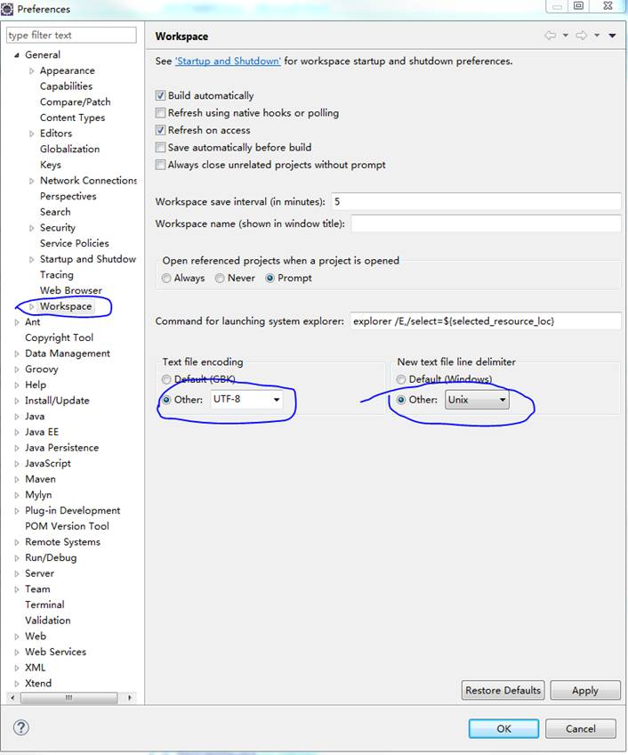

## Formatter
Eclipse提供快速格式化功能，并支持格式profile的灵活配置。为使格式化满足ODL的要求Code Style，应根据下图导入提供的[eclipse-java-google-style](https://github.com/zhanghuafei/UT-ODL-Coding-Tutorial/blob/master/formatter-profile/eclipse-java-google-style.xml)(基于eclipse-java-google-style做了部分更改)。

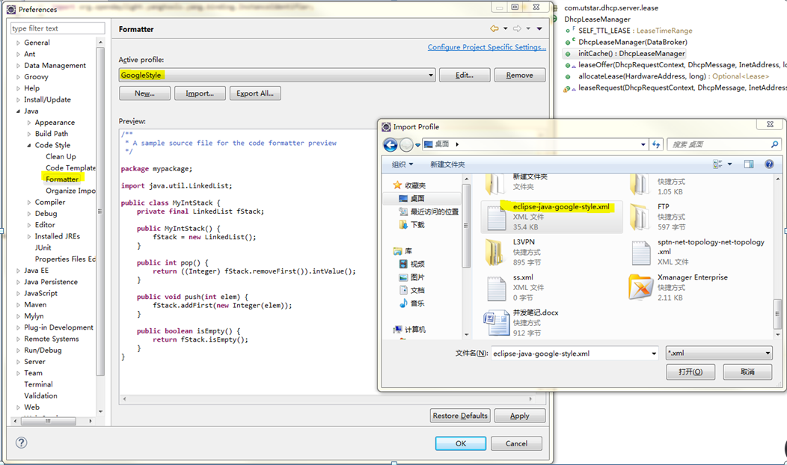

Formatter包含两种使用方式：
1. 对选中代码的码的格式化，使用快捷键Ctrl+Shift+F完成。
2. 对整个项目的格式化（待补充）。

## CheckStyle
### Step 1- Install Check-Style Plugin
- 方法1：通过Eclipse市场安装    
进入菜单Help -> Eclipse Market Place -> Search  
    搜索checkstyle
- 方法2：    
Help-> Install New Software  
    CheckStyle插件地址：http://eclipse-cs.sourceforge.net/update  
    安装完成后，根据提示重启eclipse即安装完成。

### Step 2- Check Configuration
按图导入如下三个check configuration文件并设为默认配置：
- [odl_checks.xml](https://github.com/zhanghuafei/ODL-Coding-Guidelines/blob/master/check-style/odl_checks.xml)
- [checkstyle-suppressions.xml](https://github.com/zhanghuafei/ODL-Coding-Guidelines/blob/master/check-style/checkstyle-suppressions.xml)
- [EPL-LICENSE.regexp.txt](https://github.com/zhanghuafei/ODL-Coding-Guidelines/blob/master/check-style/EPL-LICENSE.regexp.txt)

进入菜单Windows -> Preferences -> Check Style
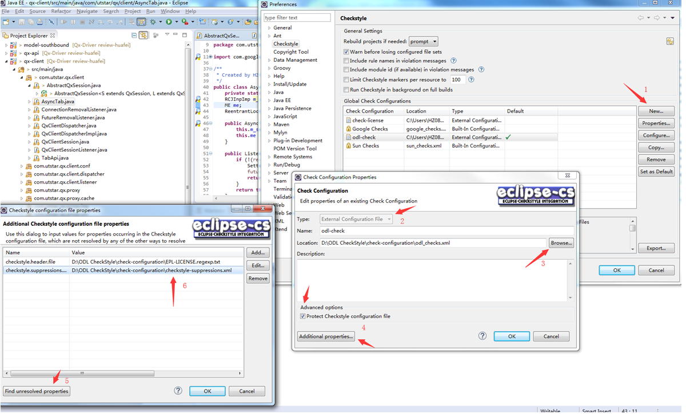

图中两个变量分别为：
- checkstyle.header.file
- checkstyle.suppressions.file
### Step 3- Activate checkstyle
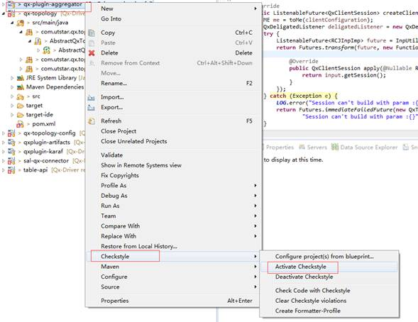

### Step 4 - Make Sure whether ChecStyle take effect
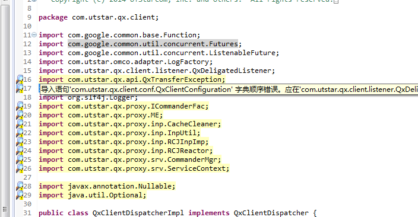

## 添加版权声明

通过如图的设置，可在新建文件时，自动将如下版权声明添加到文件中：
```
/*
 * Copyright (c) 2018 UTStarcom, Inc. and others. All rights reserved.
 *
 * This program and the accompanying materials are made available under the
 * terms of the Eclipse Public License v1.0 which accompanies this distribution,
 * and is available at http://www.eclipse.org/legal/epl-v10.html
 */
```

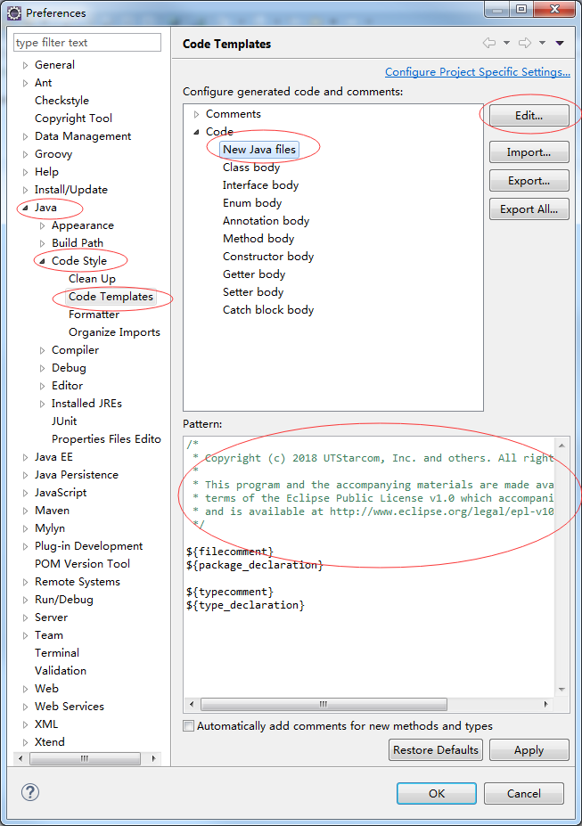

## Organize Imports
要求import order为字母序，所以应去掉Eclipse所有预置的import order。

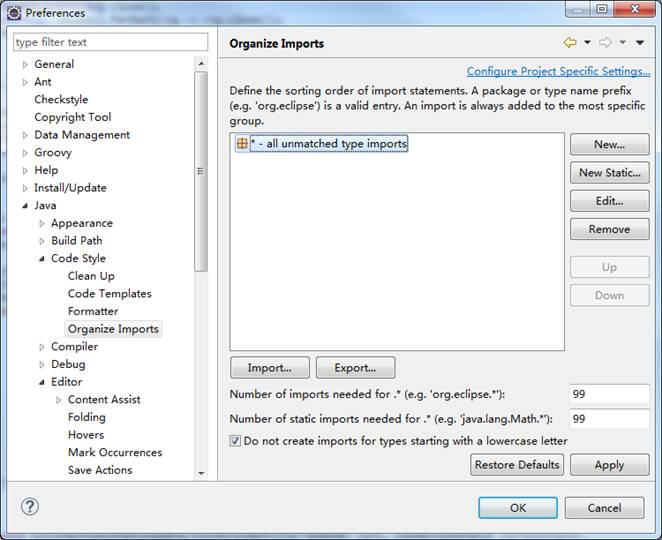

## Save Actions (Optional)
该设置可在保存文件时触发图中指定的动作，因勾选该项将导致保存文件速度过慢，所以请按需设置。

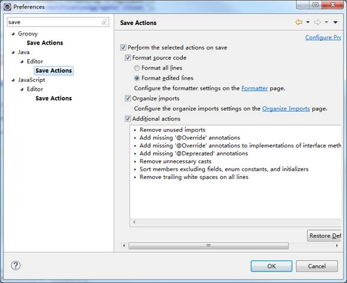

## 代码自动提示功能

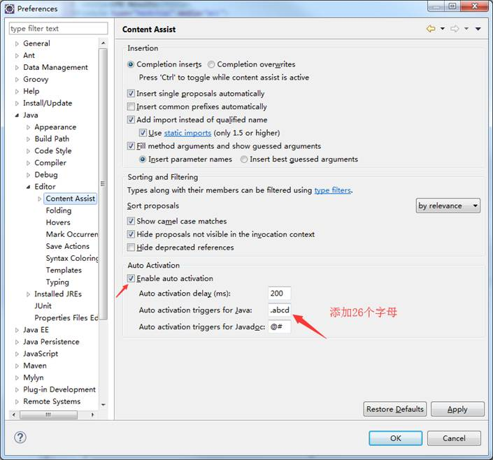

## GIT换行符设置

Git库对于文本的默认换行符为LF，Windows则默认为CRLF。
考虑跨平台开发的可能性以及checkstyle的check规则，要求工作空间的源码文件同样为LF。

    git config --global core.autocrlf input
    
通过该配置，在commit时，将自动将文本文件的CRLF转换为LF。

# Commit Message
Commit Message作为commit的历史记录，能有效帮助协作的开发人员识别每个commit的作用、目的。因此提交到远端仓库的Commit Message应遵循如下要求： 
- Provide a brief description of the change in the first line.
- Insert a single blank line after the first line.
- Provide a detailed description of the change in the following lines, breaking paragraphs where needed.
- The first line should be limited to 50 characters and should not end with a period.

下面提供两个个例子供参考：

例子1:
```
  Switch libvirt get_cpu_info method over to use config APIs

    The get_cpu_info method in the libvirt driver currently uses
    XPath queries to extract information from the capabilities
    XML document. Switch this over to use the new config class
    LibvirtConfigCaps. Also provide a test case to validate
    the data being returned.

    DocImpact // 代表需要增加关于该change的文档，触发生成文档项目的一个issue（Optional）
    Closes-Bug: #1003373  // 关闭某BUG
    Implements: blueprint libvirt-xml-cpu-model // 指向相关的蓝图规划（Optional）
    Change-Id: I4946a16d27f712ae2adf8441ce78e6c0bb0bb657
```
例子2：

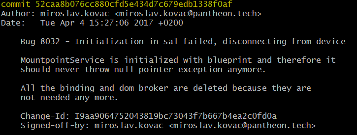

解决BUG的commit应参照该格式

要了解更多关于commit message的消息可以查看：
- [OpenStack commit message recommendations](https://wiki.openstack.org/wiki/GitCommitMessages)
- [Angular规范](http://www.ruanyifeng.com/blog/2016/01/commit_message_change_log.html)

# 静态代码分析工具
静态代码分析工具可帮助开发人员在不运行代码的情况下分析标识代码错误并提供修改建议，实践上一般能有效的检测出一些低级错误、不好的代码实践（bad practise）。下面就ODL建议的几款开源的静态代码分析工具进行简单介绍：
## FindBugs
在ODL config-parent的plugin-management中已对FindBugs插件作了相关配置。在需分析代码的模块中添加如下配置即可使FindBugs在build过程中生效。
```
   <plugins>
     <plugin>
       <groupId>org.codehaus.mojo</groupId>
       <artifactId>findbugs-maven-plugin</artifactId>
       <configuration>
         <failOnError>true</failOnError>
       </configuration>
     </plugin>
   </plugins>
```
FindBugs的分析结果可在项目目录使用图形化界面查看.
```
mvn findbugs:gui
```

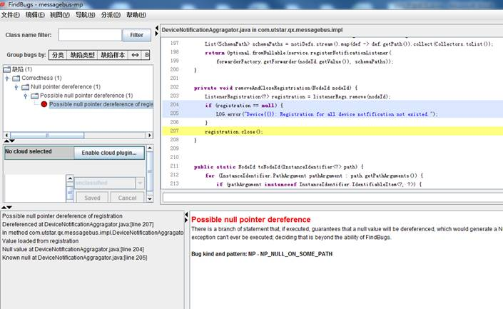

## Error-Prone
Error-Prone是由Google出品的一款静态代码分析工具。与FindBus比较：
```
Pros:
  * has faster cycle times and integrates into compilation workflow
  * emits fewer false positives
  * active maintainers fix issues
  * releases several times per year
Cons:
  * FindBugs has a greater breadth of checks
  * current error-prone releases only work with Java 8(通过参数配置可支持>=6)
```
ODL的infrautils项目提供了一个已配置好error-prone的parent pom（org.opendaylight.infrautils:parent）供项目继承，但目前我们的实现模块都统一继承了config-parent，config-parent在继承体系上并未包含org.opendaylight.infrautils:parent。

要使error-prone在build过程中生效， 应在相应项目的pom中添加profile [errorprone-unless-ide](https://github.com/opendaylight/infrautils/blob/master/common/parent/pom.xml)

要了解更多关于error-prone的消息可以查看： 
- [Error-Prone](http://errorprone.info/)

## PMD-CPD（Copy/Paste Detection）
PMD同样是一款静态代码分析工具。ODL项目在Build过程中默认使用了PMD包含的一款CPD工具，帮助检测重复代码。

 build过程在target/site/中生成cpd.html报告。Maven的输出日志中也可以查看到相应的报告信息。
 
需要注意的是，代码重复检测基于文本分析，若代码之间仅涉及微小的差异，如差异仅在处理不同的类型（type）,则可能引发“假阳性”告警。这种情况可在代码中使用相应注解消除。
```
  @SuppressWarnings("CPD-START") 
  ...
  @SuppressWarnings("CPD-END")
```

 
要了解更多关于error-prone的消息可以查看：
- [PMD](https://pmd.github.io/)

## Alibaba-P3C (Optional)
阿里巴巴集团提供的工具，基于PMD及相应IDE实现[阿里巴巴Java开发手册](https://github.com/alibaba/p3c/blob/master/%E9%98%BF%E9%87%8C%E5%B7%B4%E5%B7%B4Java%E5%BC%80%E5%8F%91%E6%89%8B%E5%86%8C%EF%BC%88%E8%AF%A6%E5%B0%BD%E7%89%88%EF%BC%89.pdf)中部分规则（目前为53条）检测。

工具包含中文提示，对于中文语言使用者相对友好。


安装对应的[Eclipse插件](https://github.com/alibaba/p3c/tree/master/eclipse-plugin)即可使用，安装方式十分方便。具体使用方式详见[教程](https://github.com/alibaba/p3c/blob/master/eclipse-plugin/README_cn.md)。

要了解更多关于P3C的消息可以查看：    

- [P3C](https://github.com/alibaba/p3c)

## 总结
任何一款静态代码分析工具都可能出现“假阳性”的警告。如下代码所示，checkstyle提示缺少default case：

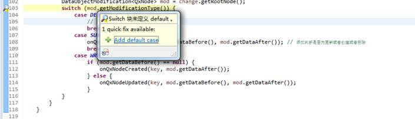

但若按checkstyle提示添加default case，ErrorProne则提示如下错误：
```
[ERROR] D:\git repo\messagebus-mp\src\main\java\com\utstar\mp\messagebus\impl\DeviceNotificationAggragator.java:[115,17] [UnnecessaryDefaultInEnumSwitch] Switch handles all enum values; an explicit default case is unnecessary and defeats error checki
ng for non-exhaustive switches.
[ERROR] (see http://errorprone.info/bugpattern/UnnecessaryDefaultInEnumSwitch)
```

因此，静态代码分析工具仅起辅助作用，通过了解提示背后的原因，不难判断出“假阳性”告警。相信借助该类辅助工具，能帮助提高对代码质量的认知，从源头上杜绝坏代码。

# 命名风格补充
## Maven artifact names
GroupId：com.utstar.项目名

ArtifactId：模块名，若名字包含多个单词，应用“-”分隔。

## YANG文件命名风格
Yang内元素的命名包含两种风格：
- 驼峰式
- 统一小写，单词之间可用“-”分隔。

倾向于使用第二种方式，但也应考虑项目内保持统一风格。

## Package Names
1. 包名使用前缀“com.utstar.项目名.组件名”。
2. 组件对外提供的接口应单独成包（package）
3. 包名统一使用小写，点分隔符之间有且仅有一个自然语义的英语单词。包名统一使用单数形式，但是类名如果有复数含义，类名可以使用复数形式。（ali-java-style）
4. 杜绝完全不规范的缩写，避免望文不知义。（ali-java-style）
5. Last segment of the package name (after component name) is used to distinguish public and private parts of the component. Public interfaces must be placed in a separate packages. In that case the implementation should be placed in a separate package as well. E.g. org.opendaylight.yang.service package contains public service definition, org.opendaylight.yang.service.impl contains service implementation, org.opendaylight.yang.service.mock contains mock implementation of the service. Recommended values are provided in the following table: 

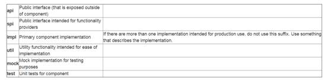

# POM依赖配置
依赖的配置应遵循按需原则。可在CMD界面下使用命令mvn dependency:analyze辅助分析依赖情况。
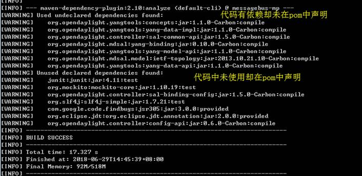


-----------------------------------------------------------------------

